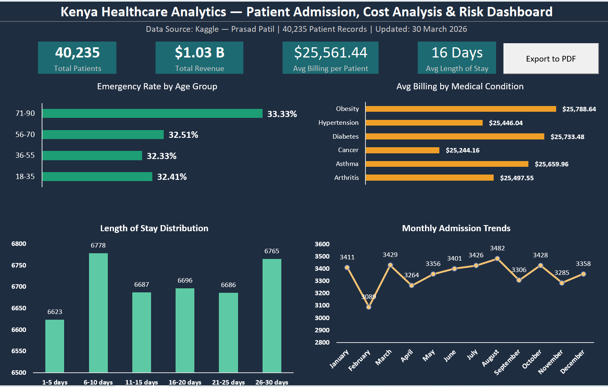
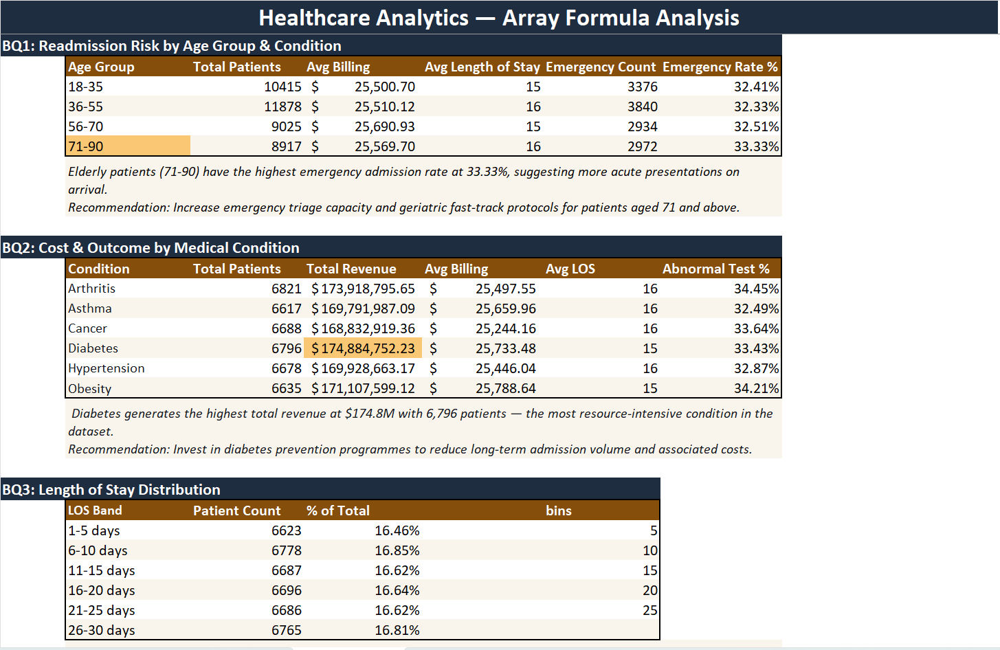
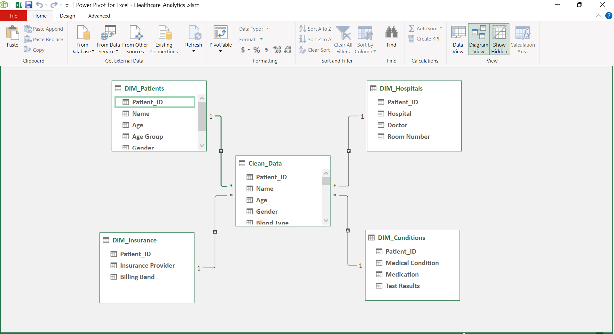
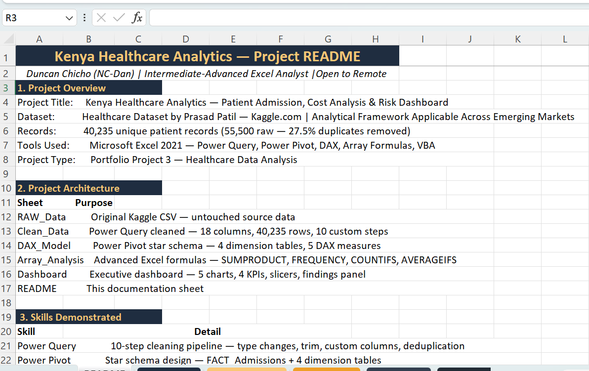

# Healthcare Analytics — Patient Admission, Cost & Risk Dashboard

**Analyst:** Duncan Chicho (NC-Dan) | Nairobi, Kenya | Open to Remote Contribution  
**Level:** Intermediate-Advanced Excel Analyst  
**Dataset:** Healthcare Dataset by Prasad Patil — [Kaggle.com](https://www.kaggle.com/datasets/prasad22/healthcare-dataset)  
**Records:** 40,235 unique patient records (55,500 raw — 27.5% duplicates removed)

## Tools & Skills Used
- Power Query — 10-step cleaning pipeline
- Power Pivot — Star schema, 4 dimension tables
- DAX — 5 custom measures
- Array Formulas — SUMPRODUCT, FREQUENCY, COUNTIFS, AVERAGEIFS
- VBA — 2 automation macros
- Dashboard Design — Dark navy + gold executive theme

## Key Findings
1. Elderly patients (71-90) have highest emergency rate at 33.33%
2. Diabetes is highest revenue condition at $174.8M
3. August is peak admission month — 13% above February low
4. Blue Cross patients incur highest avg billing at $25,784
5. 27.5% duplicate rate identified and removed during cleaning

## Screenshots
- Dashboard

- Array Analysis

- Star Schema

- Readme (Screenshot)

## Project Architecture
| Sheet | Purpose |
|---|---|
| healthcare_dataset(RAW_Data) | Original Kaggle source |
| Clean_Data | Power Query cleaned |
| DAX_Model | Power Pivot star schema |
| Array_Analysis | Advanced formula analysis |
| VBA_Automation | Macro automation |
| Dashboard | Executive dashboard |
| README | Project documentation |

## | Other Analyst Projects |  
- 🔗[Global-superstore-sales-dashboard](https://github.com/NC-Dan/global-superstore-sales-dashboard)
- 🔗[Kenya Banking Risk Dashboard](https://github.com/NC-Dan/kenya-banking-risk-dashboard)
- 🔗[www.linkedin.com/in/duncan-analytics](https://www.linkedin.com/in/duncan-analytics/)
